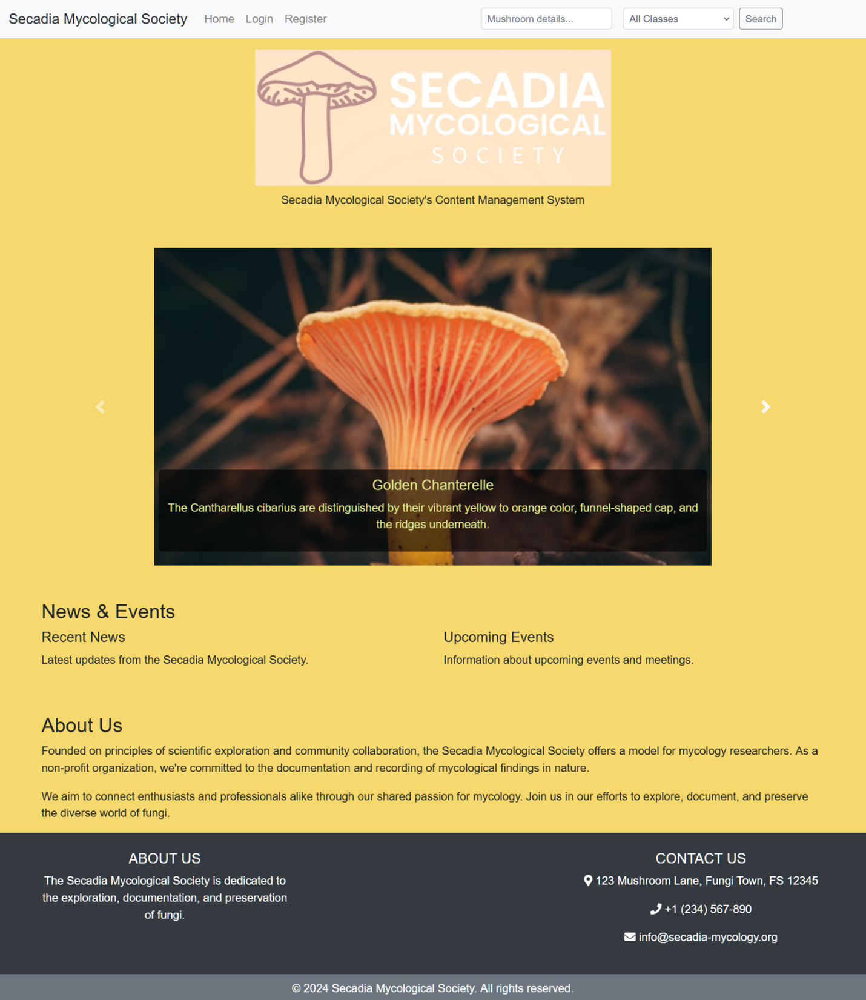
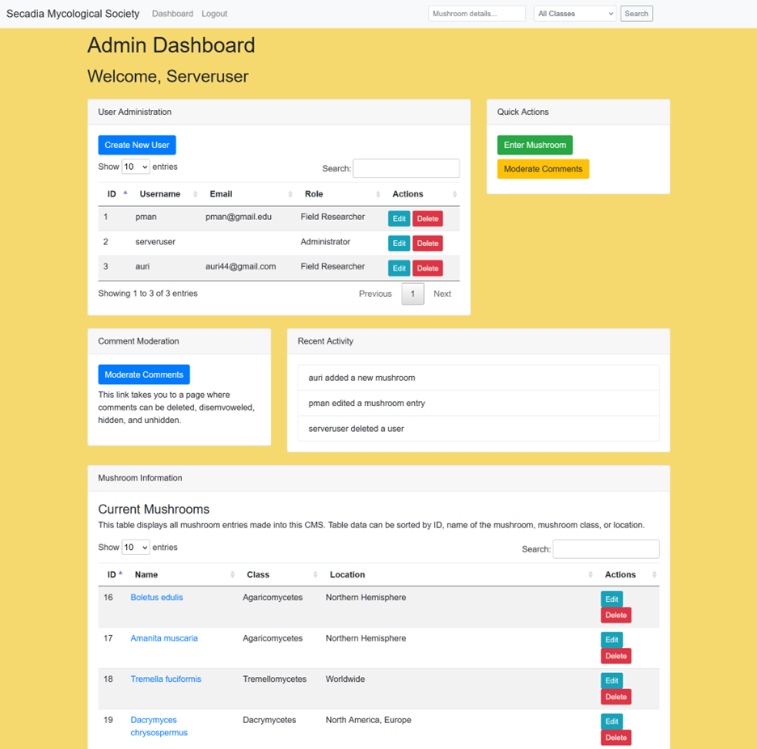
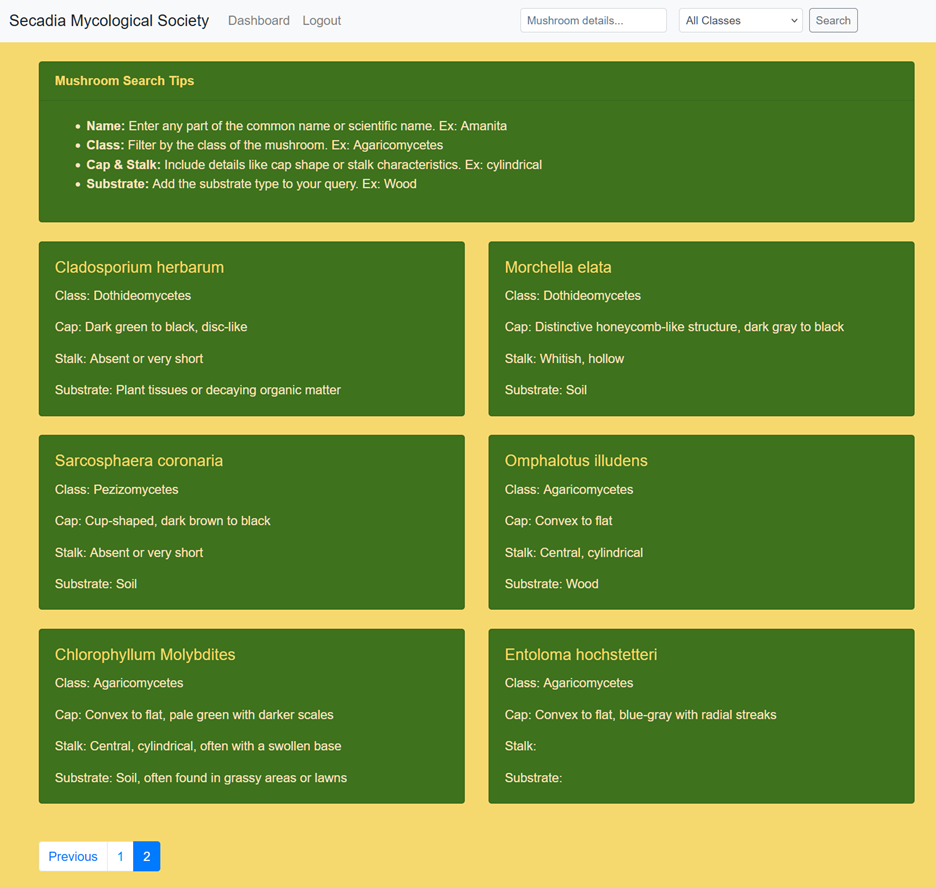

# Secadia Mycological Society CMS
This Content Management System (CMS) is designed for the Secadia Mycological 
Society to manage and document mycological data. It features role-based access 
control, advanced search functionality, user comments, and image management.

## Features
- **Role-Based Access Control**: Different access levels for Administrators, Field Researchers, and Viewers.
- **Mushroom Data Management**: Add, edit, and delete detailed mushroom records.
- **Advanced Search Functionality**: Search mushrooms by various attributes.
- **User Comments**: Comment on mushroom entries, with moderation capabilities.
- **Image Management**: Upload and associate images with mushroom records.
- **Responsive Design**: Works across different devices and screen sizes.

## Technologies Used

- **Backend**: PHP, MySQL/MariaDB
- **Frontend**: HTML, CSS, Bootstrap, JavaScript (jQuery)
- **Version Control**: Git

## Database Structure

The database consists of several tables to manage users, mushroom details, comments, locations, 
photos, substrates, categories, and pages. Key tables include:

- **users**: Stores user information and roles.
- **mushroom_details**: Stores detailed information about mushrooms.
- **comments**: Stores comments related to mushrooms.
- **locations**: Stores locations where mushrooms are found.
- **photos**: Stores photos of mushrooms.
- **substrates**: Stores substrate information related to mushrooms.
- **categories**: Stores categories for pages.
- **pages**: Stores content pages within the CMS.

## Screenshots

1. **Homepage**: 

2. **Admin Dashboard**:

3. **Search Functionality**:

